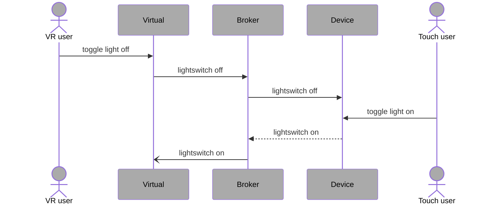

# Architecture

TrueTwin relies on several languages and server technologies to combine a physical device with a virtual one. The IoT MQTT standard for publishing and subscribing to events is the part that holds all the rest together.&#x20;

<figure><figcaption></figcaption></figure>

###

### MQTT Servers

Several servers were chosen to test their event signalling capabilities, as well as their ease of configuration, maintenance and scalability. One is HiveMQ, which is a free cloud-hosted service . Another is Mosquitto, which is an open source project. Third is RabbitMQ, which uses a different protocol and may be able to work with MQTT as well. The self-hosted servers are run locally on a linux server from Docker containers.

#### Repo

The Repository Mosquitto Server contains the configuration details and other specific information about it.

#### Execution Environment

The server runs on a Linux PC on the same LAN as the rest of the project and is not accessible on the internet.

### Device(s)

For now, there is a single physical device used. It is a Raspberry Pi 4 outfitted with a breadboard containing a switch and an LED light. A Python program is running on the device that controls the LED light via the switch. This program calls on another that connects and sends a message to the MQTT server whenever the LED light changes (on and off).

#### Repo

Paho MQTT RPi Client

#### Execution Environment

Raspberry Pi device. The messaging client can execute on the Linux PC if the payload argument is replaced with a String literal value.

### VR Environment

Both Unity and Unreal Engine were explored for their ability to integrate in the TrueTwin project scenario. Unity won on the strength of its built-in ability to pass data back and forth to web browsers using the WebX standard.

#### Repo

Browser Data 2D

#### Execution Environment

The Unity runtime is contained in a web browser. A VR experience can be loaded in a headset via the browser.

### Test/iteration tools

Before approaching the Raspberry Pi and Unity implementations it was important to test the servers to ensure that a stable, reproducible connection could be achieved at any time.  An existing project (React MQTT) had already  been used for this purpose. Additional MQTT clients were used from MQTT Client Examples (HiveMQ). These offered the convenience of running in a browser and displaying messages. The Mosquitto Server provides CLI-driven publish and subscribe clients that are useful for verifying that the server is running and responding.

#### Repo

React MQTT, MQTT Client Examples, MQTT JS HiveMQ Cloud

#### Execution Environment

Browser, CLI on Linux PC

[The list of projects used to build and support TrueTwin](https://github.com/stars/davidjmcclelland/lists/truetwin-project)
