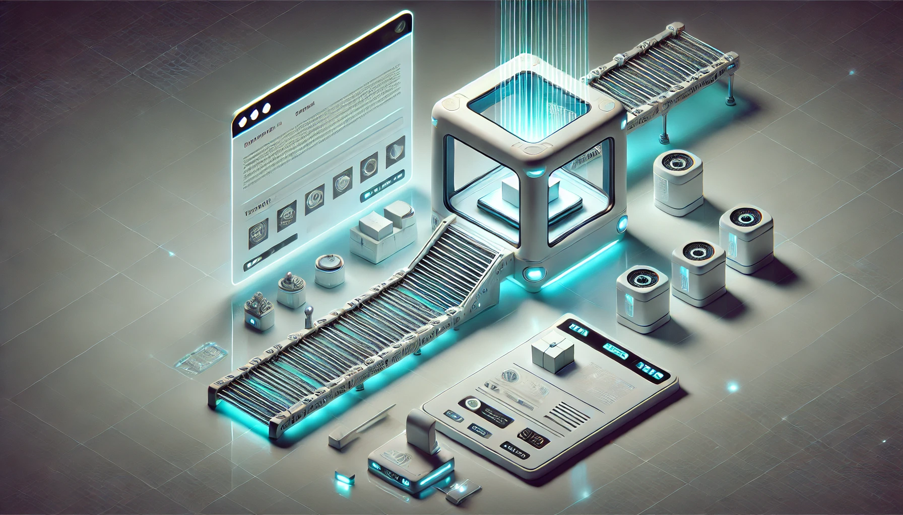

# Architecture

TrueTwin relies on several languages and server technologies to combine a physical device with a virtual one. The IoT MQTT standard for publishing and subscribing to events is the part that holds all the rest together.

<figure><figcaption></figcaption></figure>

### Sequence of Interactions

### Components and Responsibilities

#### Hardware

Software

### Message Brokers

Several message broker servers were chosen to test their event signalling capabilities, as well as their ease of configuration, maintenance and scalability. One is HiveMQ, which is a free cloud-hosted service . Another is Mosquitto, which is a self-hosted open source solution. Third is self-hosted RabbitMQ, which offers a different protocol while also supporting MQTT. I chose to run the self-hosted servers in docker containers on a seperate linux server.

### Web Server

Since the entire project environment is contained inside a LAN without internet access, the web server is almost an afterthought. The easiest way to host is to build the landing page from inside Unity. It will open the web page in a browser window automatically. A server sets the address to localhost and assigns a random port.

### Device(s)

Any internet-connected device that can run Python could be used. A Raspberry Pi 4 outfitted with a breadboard containing a switch and an LED light is the starting point. Python uses GPIO to control the switch and light. That program calls another one that connects and messages the MQTT server based on events, such as pressing the switch.

### VR Environment

Both Unity and Unreal Engine were explored for their ability to integrate in the TrueTwin project scenario. Unity won on the strength of its built-in ability to pass data back and forth to web browsers using the WebGL standard.

### Test/iteration tools

Before approaching the Raspberry Pi and Unity implementations it was important to test the servers to ensure that a stable, reproducible connection could be achieved at any time. An existing project (React MQTT) served this purpose. Additional clients were used from the MQTT Client Examples provided by HiveMQ. These offered the convenience of running in a browser and displaying messages. The Mosquitto Server provides CLI-driven publish and subscribe clients that are also useful for verifying that the server is running and responding from the server itself.

[The list of projects used to build and support TrueTwin](https://github.com/stars/davidjmcclelland/lists/truetwin-project).
