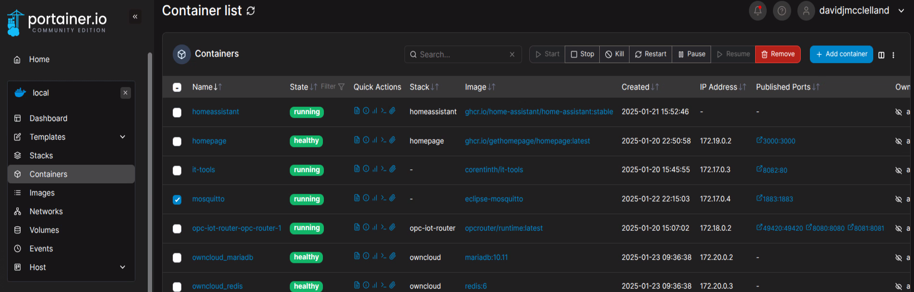

# Mosquitto Server

#### Assumptions:&#x20;

* Docker is installed in the device used to host
* Sudo-level account, firewall and terminal access on that device

#### Installation and Configuration

Cedalo.com has an [excellent, comprehensive blog post](https://cedalo.com/blog/mosquitto-docker-configuration-ultimate-guide/#How_to_use_Mosquitto_MQTT_Broker_Docker-Compose_setup) covering Mosquitto installation. The best approach is probably to create a Docker Compose yaml file and keep it under version control to track configuration changes and possibly branch variants.

The server doesn't have a UI, so the only evidence that it is running is via a Docker UI such as Portainer.

<figure><figcaption><p>Portainer view with Mosquitto Server Selected</p></figcaption></figure>

#### Use of the Test Clients

The test clients can be run in a terminal to establish a publisher and a subscriber that connect to and utilize the server. They are included in the server install.

```
mosquitto_pub -h localhost -t "myTopic" -m "Hello World!"
```

```
mosquitto_sub -h localhost -t "myTopic"
```
